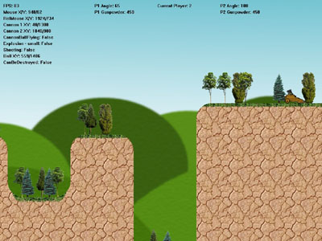



## Mortars game project

### Description

I started a VB game a while ago, on DirectDraw. It is like the popular game "cannons". There are two cannons on the battlefield which 2 players command. They should choose the right combination of velocity and angle to hit each-other. The first that manage to destroy his oponent's cannon wins.

Alas, i didn't had time to finish the game. Although i decided to publish the source. Maybe someone may find it helpful for his/her project.

The game uses DX7 DirectDraw. The keys are: "1" and "2" - select player to shoot. "z" and "x" - change angle of current player, "a" and "s" - change velocity (gunpowder) of current player, "c" center screen at the cannonball, "esc" - exit.

As i said it is unfinished. It is supposed to be turn-based, but here you can shoot with the both cannons. The effects of the exploding cannons should be fixed also. The game needs a menu and wind on the battlefield. I was alo planning to add multiplayer via Winsock. And many other things...

But what we have here is enought just for a demonstration. Every time the game starts the terrain is different (randomly generated) also the places of the cennons are different. Destructable terrain. Arrow at the edges of the screen when the cannonball leaves the screen ("Worms" style :)

I hope you find it useful. I don't expect 10s for it, but at least tell me your oppinion.
 
### More Info
 

             |
---                |---
**Submitted On**   |2005-06-06 21:35:02
**By**             |[TTsvetkov](https://github.com/Planet-Source-Code/PSCIndex/blob/master/ByAuthor/ttsvetkov.md)
**Level**          |Intermediate
**User Rating**    |4.5 (18 globes from 4 users)
**Compatibility**  |VB 6\.0
**Category**       |[Games](https://github.com/Planet-Source-Code/PSCIndex/blob/master/ByCategory/games__1-38.md)
**World**          |[Visual Basic](https://github.com/Planet-Source-Code/PSCIndex/blob/master/ByWorld/visual-basic.md)
**Archive File**   |[Mortars\_ga1927648262005\.zip](https://github.com/Planet-Source-Code/ttsvetkov-mortars-game-project__1-62334/archive/master.zip)

